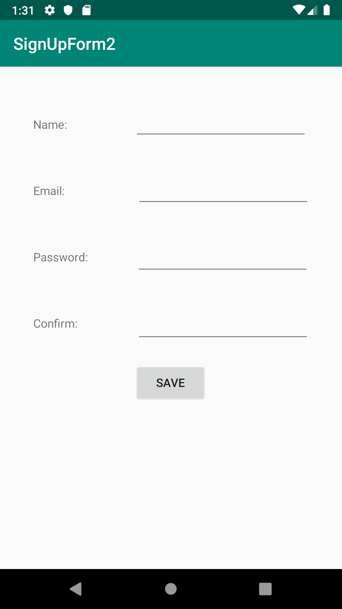

This project demonstarates a working sign in form sheet with data validation.
Users can input their name, email, and password into the form and the program checks for the following criteria:
If all the values are filled out
If the passwords match

If the user meets this criteria then a sign in message is given, which uses the given name.

